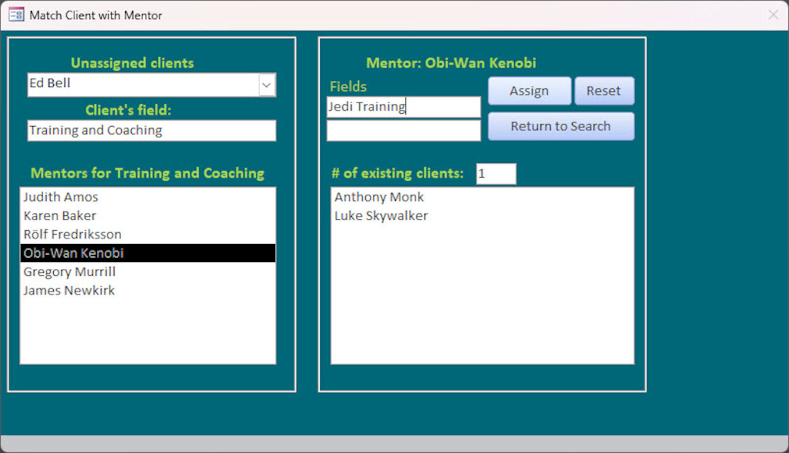

# Access Projects - Volume 1: This repo contains screen shots from two personal projects I've done in Microsoft Access

## A personal project I did some time ago to keep track of my monthly budgets (Can't decide on Quickbooks or Peachtree? Why not just make your own?)

## A project I made as a "challenge" for a mentor some time back, the idea which is to pair up career mentors (in various fields) with candidates looking to enter those fields.
### A video demo of this project can be found here : 

